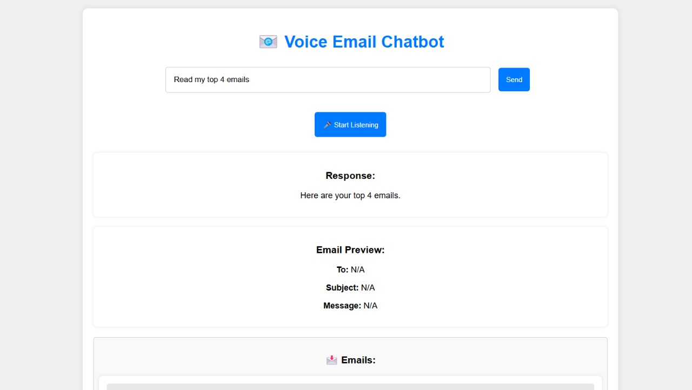

# Voice-to-Voice AI Email Chatbot

This is a hands-free, voice-controlled AI chatbot for managing Gmail. It allows users to read, send, and manage emails using voice commands. The chatbot integrates:

- **Speech-to-Text (STT)** to process voice commands.
- **Natural Language Processing (NLP)** to understand email-related queries.
- **Gmail API** for email retrieval and sending.
- **Text-to-Speech (TTS)** to read emails aloud.

---

## 🚀 Features

✔ **Hands-free email management** via voice commands.  
✔ **Read latest emails** and summarize them.  
✔ **Send emails** using voice input.  
✔ **Gmail authentication** via OAuth 2.0.  
✔ **Error handling and logging** for a seamless experience.  

---

## 🛠️ Setup Instructions

### **1️⃣ Enable Gmail API & OAuth 2.0**

1. **Go to Google Cloud Console:**  
   [Google Cloud Console](https://console.cloud.google.com/)

2. **Create a new project.**

3. **Enable Gmail API:**
   - Navigate to `APIs & Services` > `Library`.
   - Search for **Gmail API** and click `Enable`.

4. **Set up OAuth Consent Screen:**
   - Go to `APIs & Services` > `OAuth consent screen`.
   - Select `External`, add scopes for Gmail API (`../auth/gmail.readonly` and `../auth/gmail.send`).
   - Save changes.

5. **Create OAuth Credentials:**
   - Go to `APIs & Services` > `Credentials`.
   - Click `Create Credentials` > `OAuth Client ID`.
   - Select `Web application`, add `http://localhost:5000` as an authorized redirect URI.
   - Download `credentials.json`.
**Move `credentials.json` into the project directory.**

6. **Add Your Email as a Test User:**
   - Go to Google Cloud Console: [Google Cloud Console](https://console.cloud.google.com/)
   - Open `API & Services` → `OAuth Consent Screen`
   - Scroll down to "Test Users"
   - Add your email like `(okg5166@gmail.com)`.
   - Click `Save & Continue`.
**Now test user email is added succesfully and you can authencate and login easily with that email and use the bot...**
---

### **2️⃣ Install Dependencies**

```bash
pip install -r requirements.txt
```

---

### **3️⃣ Run the Application**

```bash
python app.py
```

---

## 🎤 Usage Guide

### **Read Emails**
- Say: _"Read my top 2 emails."_
- The bot will fetch and read the latest emails.

### **Send an Email**
- Say: _"Send an email to [recipient] with subject [subject] and message [body]."_

### **Sending email with final verification from Bot**
- Say: _"Send or send email or anything to send your composed email."_

---

## 🖼️ Screenshots of working application

### **Providing command for reading top 4 commands...**


### **Fetched and audible Emails...**


### **Providing speech command to write an email...**


### **Providing Recipient email address...**


### **Adding subject and message/content and verifying whole composed email content...**


### **Providing last 'send' command for verification of sending.**


### **Google API Setup**


### **Add test email user for accessing Gmail through bot under APIs and services > Audience > Add users**


### **And follow the above process mentioned Setup Instruction for smoothly making application working...**

---

## 🔧 Troubleshooting for any other errors...

**1. Getting authentication errors?**  
- Ensure `credentials.json` is correctly placed in the project directory.
- Delete the existing `token.json` and re-run authentication.

**2. pyttsx3 not working on Windows?**  
- Try running: `pip install pywin32`

**3. Flask not running properly?**  
- Ensure port `5000` is free, or specify another port in `app.py`.

---

## 🎯 Future Improvements
- **Improve NLP** for better voice command understanding.
- **Add more email management features** (archiving, deleting emails).

---

## 📝 License
This project is licensed under the MIT License.
